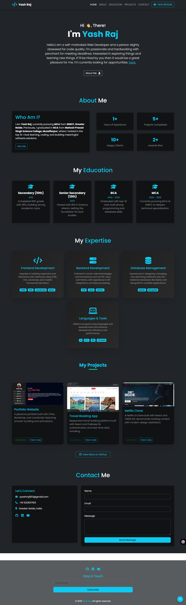

# Yash Raj - Portfolio Website



Welcome to my personal portfolio website! This website showcases my skills, projects, education, and contact information in a sleek, responsive, and interactive layout.

**Live Demo:** [yashrajhub.netlify.app](https://yashrajhub.netlify.app)

---

## **About Me**

Hi! I am **Yash Raj**, a self-motivated web developer passionate about coding, building meaningful projects, and exploring new technologies. I am currently pursuing **MCA** from **GNIOT, Greater Noida**, and have previously completed **BCA** from **Mahesh Prasad Singh Science College, Muzaffarpur**.  

I specialize in front-end and back-end development and enjoy building clean, efficient, and responsive applications. I am actively looking for opportunities to contribute and grow in the field of software development.

---

## **Features**

- Fully responsive website, works on all screen sizes (mobile, tablet, desktop)
- Smooth scrolling and animations using **Animate.css** and **AOS**
- Typed.js animation for dynamic role display
- Dark theme with modern UI design
- Sections included:
  - Home
  - About
  - Education
  - Skills/Expertise
  - Projects
  - Contact

---

## **Skills Highlighted**

### Frontend Development
- HTML5, CSS3, JavaScript
- Bootstrap 5
- Responsive design
- React (in projects)

### Backend Development
- Java
- PHP
- Python
- API Integration

### Database
- MySQL
- MongoDB

### Tools & Languages
- Git, VS Code
- C, C++

---

## **Projects**

1. **Portfolio Website**  
   - Built with HTML, CSS, Bootstrap, and JavaScript.  
   - Features smooth scrolling, responsive design, and dynamic animations.  
   - **Live Demo:** [View](https://yaahrit.netlify.app)  
   - **Code:** [GitHub](https://github.com/Yaahrit/portfolio)

2. **Travel Booking App**  
   - Built with React and Firebase.  
   - Handles authentication, real-time data, and responsive UI.  
   - **Code:** [GitHub](https://github.com/Yaahrit/Wanderland)

3. **Netflix Clone**  
   - Built with React and TMDB API.  
   - Dynamically fetches movies and shows with modern UI aesthetics.  
   - **Code:** [GitHub](https://github.com/Yaahrit/netflix)

*More projects available on [GitHub](https://github.com/Yaahrit).*

---

## **Contact Me**

Feel free to reach out through email or social media:

- Email: syashraj903@gmail.com
- Phone: +91 6206117613
- LinkedIn: [linkedin.com/in/yashrajhub](https://www.linkedin.com/in/yashrajhub/)
- GitHub: [github.com/Yaahrit](https://github.com/Yaahrit)

Or send a message via the contact form on the website.

---

## **Technologies Used**

- **Frontend:** HTML, CSS, JavaScript, Bootstrap, Animate.css, AOS
- **Animations:** Typed.js
- **Deployment:** Netlify

---

## **How to Use / Run Locally**

1. Clone the repository:
   ```bash
   git clone https://github.com/Yaahrit/portfolio.git
## **2.Navigate to the project directory:**
      cd portfolio
## 3.Open index.html in a browser to view locally.

## License.
This project is for personal portfolio purposes. You may use the code for learning and reference only.

Made with ❤️ by Yash Raj
